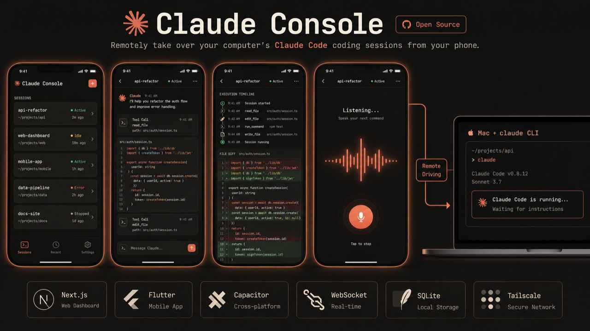
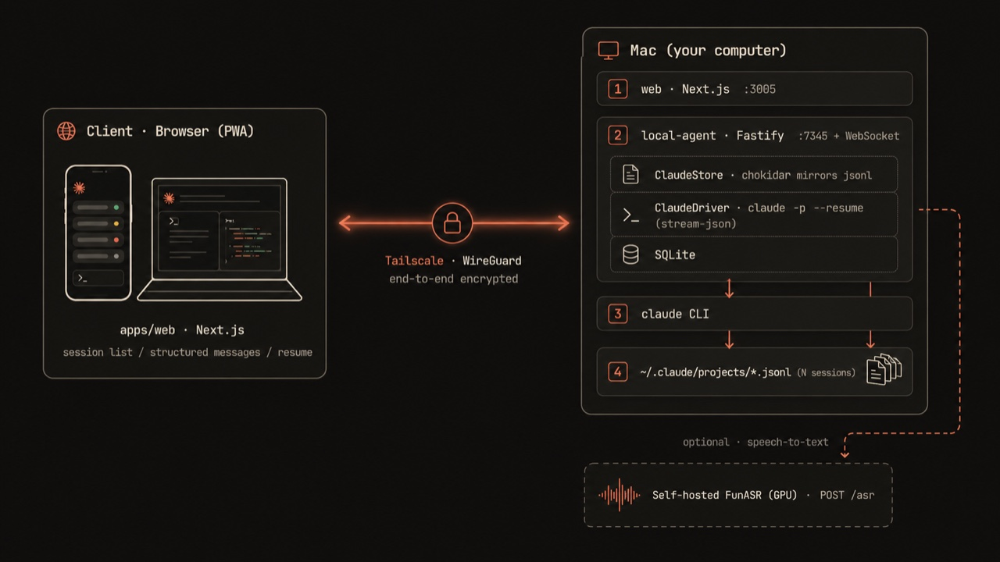

# Claude Console

> 免代理、可个性化的 **Claude Code** 远程客户端——浏览器直连接管你电脑上的 AI 编程会话。



一个由 **本地 Agent 服务 + Web 控制台（PWA）** 组成的纯网页方案。后端跑在你的 Mac 上，
读取 `~/.claude/projects` 的会话、用 `claude` CLI 驱动；手机/电脑浏览器经 **Tailscale** 直连，
无需公网服务器，也可「添加到主屏幕」当原生 App 用。

## 架构总览



* **@mac/shared** — Zod schemas + 类型（ClaudeSession / ClaudeMessage / WS 协议），单一真相来源。
* **@mac/local-agent** — Fastify + `ws` + SQLite 本地服务（默认 `127.0.0.1:7345`，可 `MAC_AGENT_BIND` 暴露到 Tailscale）。
  * `ClaudeStore`：扫描/解析/`chokidar` 实时镜像 `~/.claude/projects/*.jsonl`。
  * `ClaudeDriver`：`claude -p --resume/--session-id --output-format stream-json` 驱动续写/新建。
* **@mac/web (apps/web)** — Next.js 14 + Zustand + Tailwind，Claude Code 风格深色 UI；会话列表 / 结构化消息 / 续写接管；电脑手机双适配 + PWA（可装到主屏幕）。

详见 [docs/architecture.md](docs/architecture.md) 与 [docs/remote-access.md](docs/remote-access.md)。

## 仓库结构

```
packages/
  shared/         共享 zod schemas + 类型
  local-agent/    本地 HTTP/WS Agent（ClaudeStore + ClaudeDriver）
apps/
  web/            Next.js Web 控制台（Claude Code 风格，PWA）
scripts/
  install-daemon.sh / uninstall-daemon.sh   launchd 常驻 agent
  dev.sh                                    并行起 agent + web
docs/             架构、API、远程接入等文档
```

## 快速开始

### 前置
* Node.js ≥ 20、pnpm ≥ 10
* `claude` CLI 已登录（agent 复用本机凭据，零配置）
* 复制 `.env.example` 为 `.env`，按需设置 `MAC_AGENT_PASSWORD`（经 Tailscale 远程访问时**建议**开启密码登录）

### 安装与测试
```bash
pnpm install
pnpm test            # shared + local-agent + web，共 107 测试
```

### 本地联调
```bash
./scripts/dev.sh
# local-agent: 127.0.0.1:7345
# web:         http://localhost:3005
# 浏览器打开 web，填入 agent 地址 http://127.0.0.1:7345 即可连接
# 若设置了 MAC_AGENT_PASSWORD，连接时一并输入该密码
```

### 常驻 + 远程接入（Tailscale 直连，无需公网服务器）
```bash
# 1) Mac 上把 agent 装成 launchd 守护进程，绑定到 Tailscale IP
MAC_AGENT_PASSWORD=<password> MAC_AGENT_BIND=$(tailscale ip -4) ./scripts/install-daemon.sh

# 2) 手机装同一 tailnet 的 Tailscale，浏览器打开 http://<mac-tailscale-ip>:3005
#    「服务器地址」填 http://<mac-tailscale-ip>:7345，输入上面的密码
#    iOS Safari / Android Chrome 可「添加到主屏幕」当 App 用
```

流量经 Tailscale WireGuard 端到端加密，不经公网。详见 [docs/remote-access.md](docs/remote-access.md)。

### 开启 HTTPS（语音输入必需）

浏览器麦克风（`getUserMedia`）只在 HTTPS / localhost 下可用，所以纯 http 直连**无法用语音**。
Tailscale 自带 HTTPS：`tailscale serve` 会为 MagicDNS 主机名签发真证书（`*.ts.net`），无需自有域名。

```bash
# 0) 一次性：Tailscale 管理后台 → DNS → 启用 MagicDNS 和 HTTPS Certificates

# 1) Mac 上把 web 和 agent 各用一个 HTTPS 端口代理出去
tailscale serve --bg --https=443  localhost:3005   # web  → https://<host>.<tailnet>.ts.net
tailscale serve --bg --https=8443 localhost:7345   # agent→ https://<host>.<tailnet>.ts.net:8443
tailscale serve status                              # 查看；tailscale serve reset 清空

# 2) 手机浏览器开 https://<host>.<tailnet>.ts.net （HTTPS → 麦克风可用）
#    「服务器地址」填 https://<host>.<tailnet>.ts.net:8443
```

> 用两个 HTTPS 端口是为避免「HTTPS 页面连 http agent」的混合内容拦截；两端皆 HTTPS，WS
> 自动走 `wss://…:8443/ws`，无跨域（agent 默认 `CORS=*`）。配 serve 后 agent 保持默认绑
> `127.0.0.1` 即可（serve 在本机代理）。同源 `/agent` 方案见 [docs/remote-access.md](docs/remote-access.md)。

## 能力边界

| 能力 | 状态 |
| --- | --- |
| 实时看电脑上正在跑的会话（流式镜像） | ✅ |
| 续写历史会话（resume） | ✅ |
| 从浏览器新开会话并全程驱动 | ✅ |
| 接管「终端仍活跃」的同一会话 | ⚠️ 提示确认后 force 接管（避免双进程抢同一会话） |

## 本期不做（后续）

* 公网直接访问（当前走 Tailscale 直连；tailnet 已加密，无需自建 TLS）
* 原生 App 客户端（当前用 PWA「添加到主屏幕」替代）
* 手机审批工具权限（headless 先 `acceptEdits` 兜底）

## 安全提示

未设 `MAC_AGENT_PASSWORD` 时 agent **开放直连**（无登录环节），仅适合回环本机使用。
agent 默认仅绑定 `127.0.0.1`；一旦通过 `MAC_AGENT_BIND` 暴露到 Tailscale 接口，
**务必**设置 `MAC_AGENT_PASSWORD` 开启密码登录，否则同一 tailnet 内任何能访问该端口的人
都能驱动你的 `claude` CLI。**不要把 agent 绑到 `0.0.0.0` 或直接暴露公网。**
详见 [docs/security.md](docs/security.md)。

## 语音识别（ASR）

语音输入（[apps/web/lib/recorder.ts](apps/web/lib/recorder.ts) 录 16k 单声道 PCM →
`POST /asr` → [packages/local-agent/src/asr.ts](packages/local-agent/src/asr.ts)）当前走
**腾讯云「一句话识别」**，需 `VOICE_SECRET_ID` / `VOICE_SECRET_KEY`。

**规划：替换为自建 FunASR**（去依赖云服务、可离线、数据不出本机）：

* 模型：[Fun-ASR-Nano-2512](https://huggingface.co/FunAudioLLM/Fun-ASR-Nano-2512)（LLM-based，31 语言，准确率高，GPU 部署）。
  其它可选 SenseVoiceSmall（快、CPU 可跑）/ Paraformer-zh（纯中文）。
* 部署：Docker 镜像见 [deploy/funasr/](deploy/funasr/)（`Dockerfile` + `server.py`，已就绪）。
  在带 N 卡的 Linux 机器上 `docker build` 起一个与现有 `/asr` 同形态的 HTTP 服务。
* 对接（**待接线，尚未改代码**）：`asr.ts` 增加后端选择——设了 `FUNASR_URL`
  （如 `http://<gpu-host>:7346`）就转发到自建服务，否则回退腾讯云，平滑切换。

部署细节与模型对比见 [deploy/funasr/README.md](deploy/funasr/README.md)。

## License

[MIT](LICENSE) © 2026 Li Yonghua
